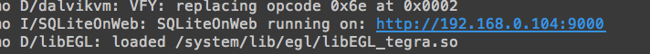
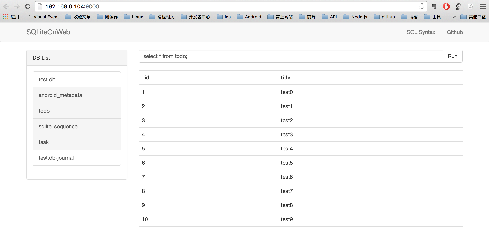

#SQLiteOnWeb
> A simple tool to see sqlite database data in browser

##Install 

Gradle:

```
debugCompile 'io.github.skyhacker2:sqliteonweb:1.0.1'
releaseCompile 'io.github.skyhacker2:sqliteonweb-no-op:1.0.2'
```

## Setup

In `Application` or `Activity`
wow
```
SQLiteOnWeb.init(this).start();

```

SQLiteOnWeb use `NanoHTTPD` as server and run at 9000 port default.

Use custom port to start.

```
SQLiteOnWeb.init(this, PORT).start();
```

## Run Debug App

When run app in debug mode, you will see the address in `Android Monitor`



Click the address open in browser.

You can run SQL from browser to query insert or update.

Have fun. 🚀



## License

SQLiteOnWeb is available under the MIT license. See the LICENSE file for more info.
